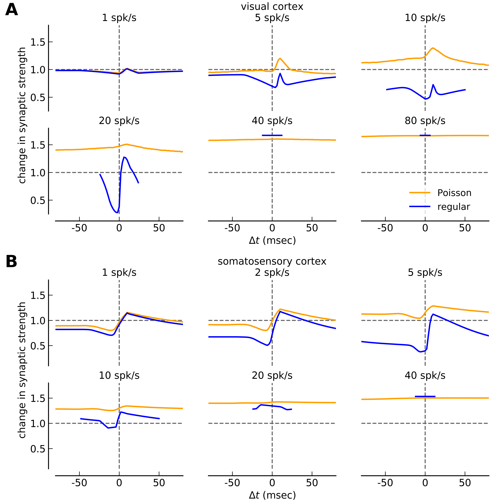
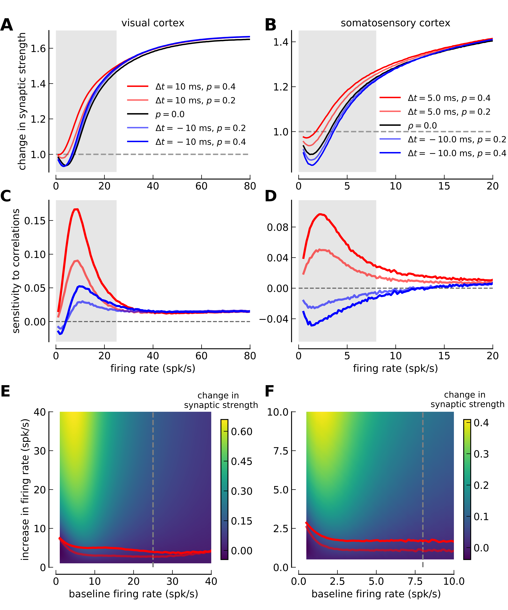
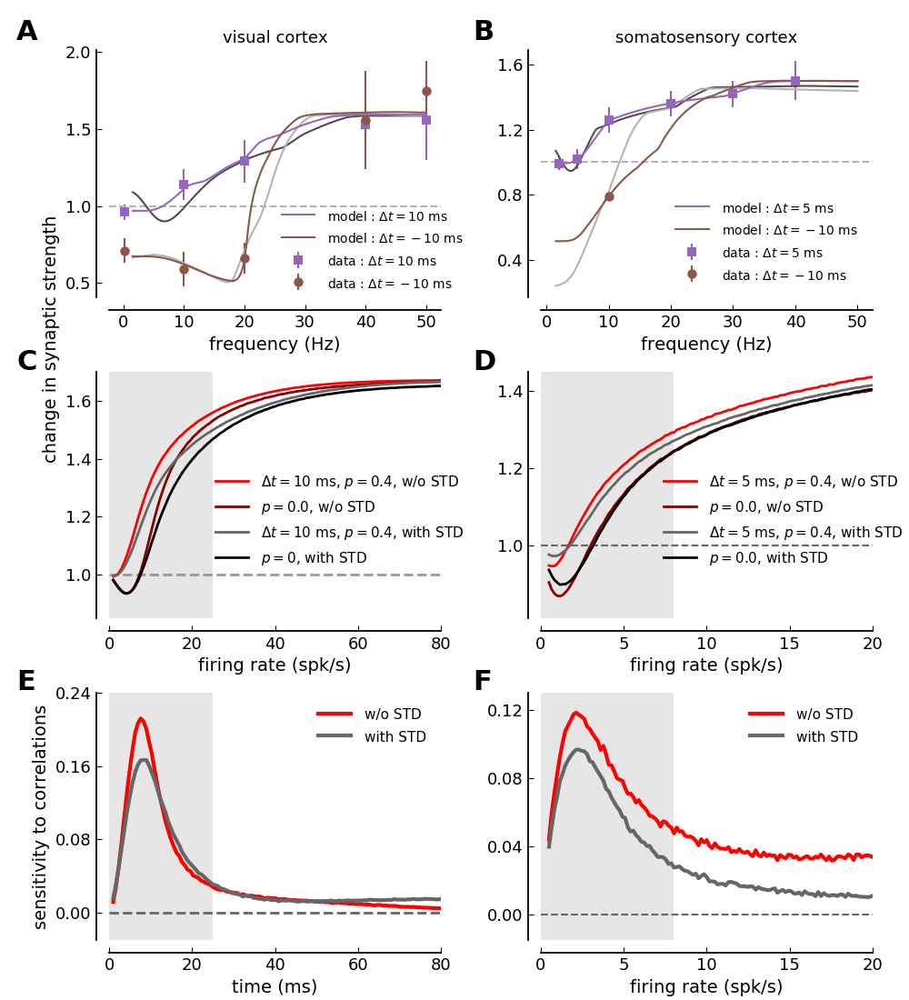
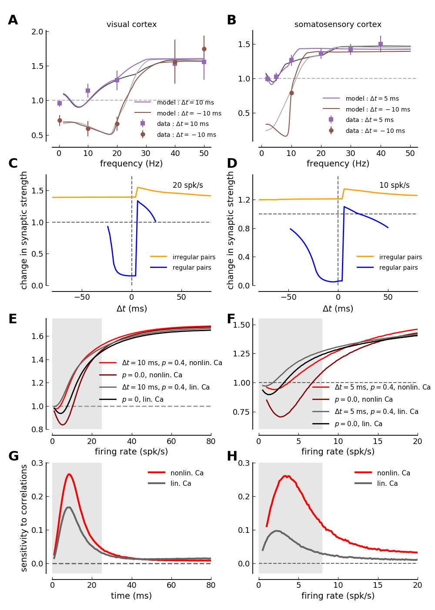

Short-term depression and long-term plasticity together tune sensitive range of synaptic plasticity
==============================

Find here code and information related to

**Deperrois N and Graupner M (2019).**
Short-term depression and long-term plasticity together tune sensitive range of synaptic plasticity.
*accepted in PLoS Comput Biol*; [bioRxiv 565291; doi: 10.1101/565291](https://doi.org/10.1101/565291).

Figures
-----------

**Fig. 3 : Change in synaptic strength in response to irregular and regular spike-pairs at different firing rates.**


The data has to be first calculated by running `irregularPairs_stpDet-Markram-Ca-Model.py` and `irregularPairs_stpDet-Sjoestroem-Ca-Model.py` for the
somatosensory- and the visual cortex parameter sets, respectively. The compound figure is subsequently generated by the script
`fig_STDPcurves_STDdeterministic_irregular-vs-regular.py`.

```python
python irregularPairs_stpDet-Markram-Ca-Model.py
python irregularPairs_stpDet-Sjoestroem-Ca-Model.py
python fig_STDPcurves_STDdeterministic_irregular-vs-regular.py
```

**Fig. 4 : Comparing the sensitivity of synaptic plasticity to firing rate and spike-timing between visual- and somatosensory cortex.**


The data has to be first calculated by running `irregularPairs_stpDet-Markram-Ca-Model.py` and `irregularPairs_stpDet-Sjoestroem-Ca-Model.py` for the
somatosensory- and the visual cortex parameter sets, respectively. The compound figure is subsequently generated by the script
`fig_rate-vs-correlations_STDdeterministic.py`.

```
python irregularPairs_stpDet-Markram-Ca-Model.py
python irregularPairs_stpDet-Sjoestroem-Ca-Model.py
python fig_rate-vs-correlations_STDdeterministic.py
```


**Fig. 5 : Comparison between model versions with and without short-term depression.**


The data has to be first calculated by running `irregularPairs_NostdDet-Markram-Ca-Model.py` and `irregularPairs_NostpDet-Sjoestroem-Ca-Model.py` for the
somatosensory- and the visual cortex parameter sets, respectively. The compound figure is subsequently generated by the script
`fig_compareSTDvsNoSTD.py`.

```
python irregularPairs_NostdDet-Markram-Ca-Model.py
python irregularPairs_NostpDet-Sjoestroem-Ca-Model.py
python fig_compareSTDvsNoSTD.py
```


**Fig. 6 : Comparison of synaptic changes in linear- and nonlinear calcium dynamics model versions.**


The data has to be first calculated by running `irregularPairs_NonlinCa-Markram-Ca-Model.py` and `irregularPairs_NonlinCa-Sjoestroem-Ca-Model.py` for the
somatosensory- and the visual cortex parameter sets, respectively. The compound figure is subsequently generated by the script
`fig_compareLinvsNonlinCa.py`.

```
python irregularPairs_NonlinCa-Markram-Ca-Model.py
python irregularPairs_NonlinCa-Sjoestroem-Ca-Model.py
python fig_compareLinvsNonlinCa.py
```

