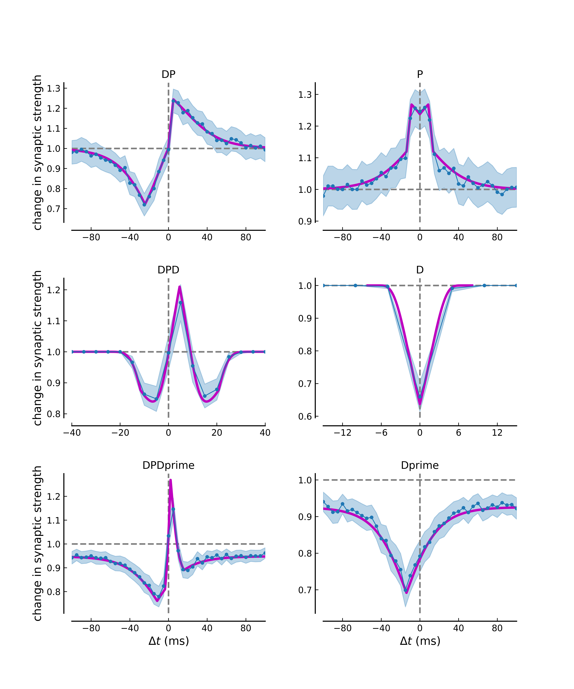
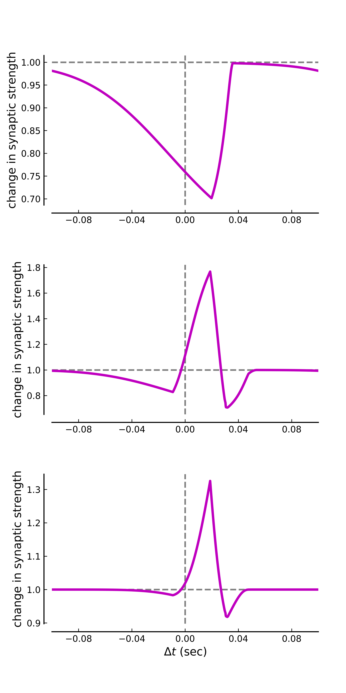
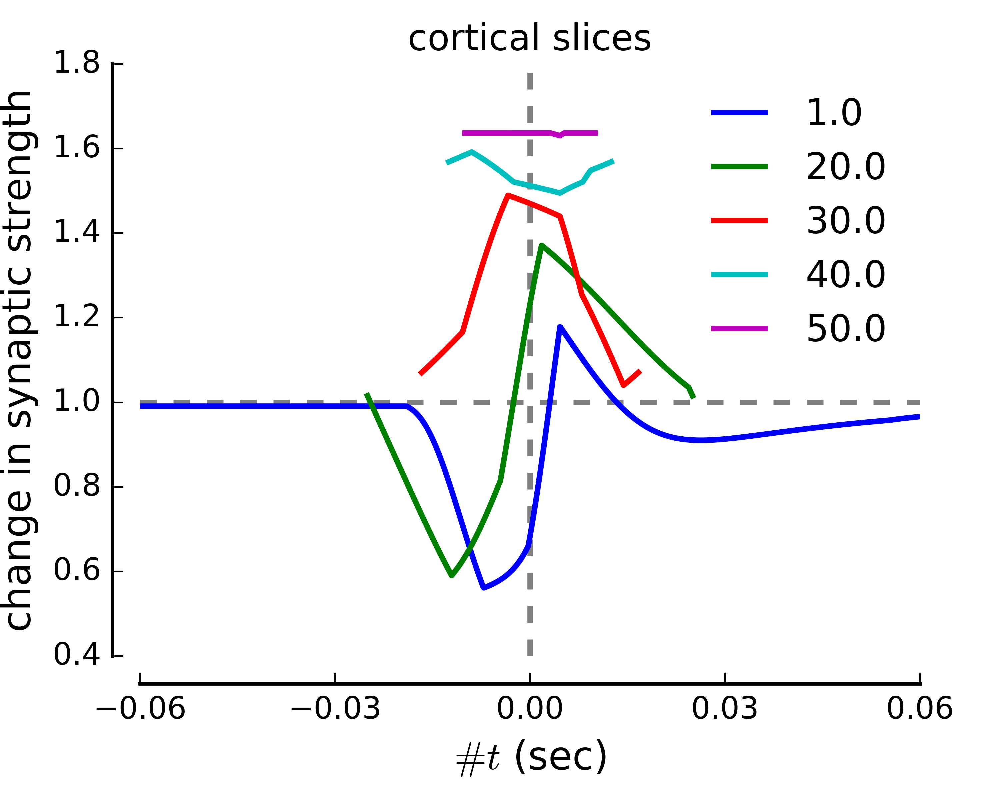

Calcium-based plasticity model
==============================

Find here code and information related to

**Graupner M and Brunel N (2012).**
Calcium-based plasticity model explains sensitivity of synaptic changes to spike pattern, rate, and dendritic location.
[*PNAS 109 (10): 3991-3996.*](http://www.pnas.org/content/109/10/3991.abstract)

Figures
-----------

### PNAS 2012 Fig. 2 : Diversity of STDP curves in response to spike pair stimulation.


### PNAS 2012  Fig. 3 : Numbers of postsynaptic spikes and repetitions of the stimulation motif qualitatively change the STDP curve.


### PNAS 2012 Fig. 4 : Plasticity for spike pairs vs. firing frequency.


Change parameters and re-produce Figures
-----------

The parameter values for the stimulation protocol can be changed in `Graupner2012PNAS_FigXX.py` (with XX=2,3 or 4B). Equivalently, the parameters of the plasticity model implementation can be changed in  `synapticChange.py` . The png and pdf versions of the figures can be produced by running the scripts
```python
python Graupner2012PNAS_Fig2.py
python Graupner2012PNAS_Fig3.py
python Graupner2012PNAS_Fig4B.py
```
