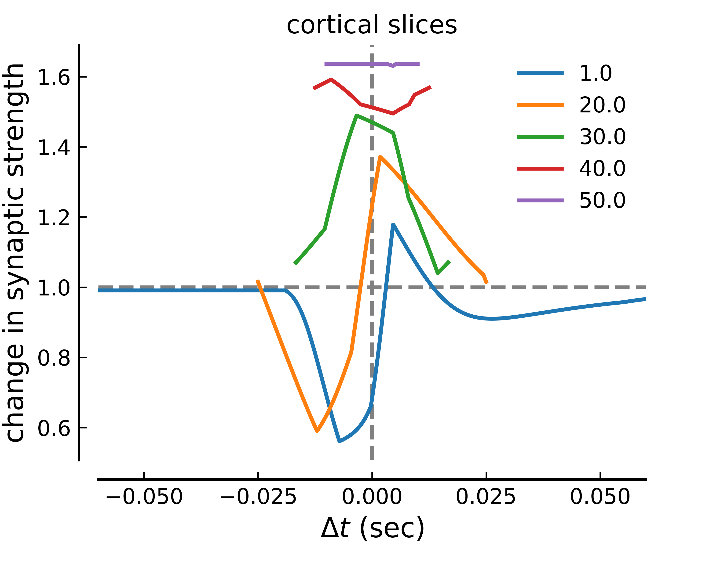

Calcium-based plasticity model explains sensitivity of synaptic changes to spike pattern, rate, and dendritic location
==============================

Find here code and information related to

**Graupner M and Brunel N (2012).**
Calcium-based plasticity model explains sensitivity of synaptic changes to spike pattern, rate, and dendritic location.
[*PNAS 109 (10): 3991-3996.*](http://www.pnas.org/content/109/10/3991.abstract)

Figures
-----------

The parameter values for the stimulation protocol can be changed in `Graupner2012PNAS_FigXX.py` (with XX=2,3 or 4B).
Equivalently, the parameters of the plasticity model implementation can be changed in  `synapticChange.py` .

**Fig. 2 : Diversity of STDP curves in response to spike pair stimulation.**


Note that the figure also displays the results of numerical integrations of the full model. The simulations are provided as C++ code
in [numericalSimulations](numericalSimulation/).

The png and pdf versions of Fig. 2 can be produced by running the script :
```
python Graupner2012PNAS_Fig2.py
```

**Fig. 3 : Numbers of postsynaptic spikes and repetitions of the stimulation motif qualitatively change the STDP curve.**


The png and pdf versions of Fig. 3 can be produced by running the script :
```
python Graupner2012PNAS_Fig3.py
```

**Fig. 4 : Plasticity for spike pairs vs. firing frequency.**




The png and pdf versions of the Fig. 4B can be produced by running the script :
```
python Graupner2012PNAS_Fig4B.py
```


