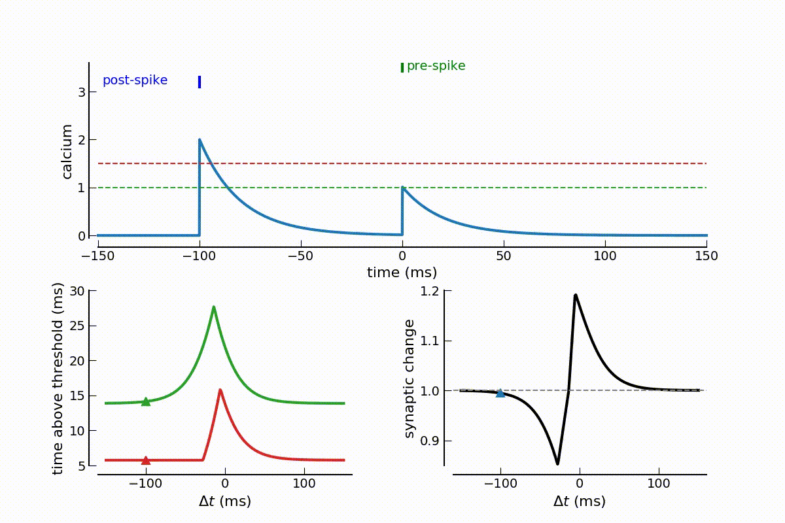

Calcium-based plasticity model
==============================

Synaptic plasticity, the change in efficacy of connections between neurons, is thought to underlie learning and memory.
Synaptic plasticity is sensitive to the rate and the timing of presynaptic and postsynaptic action potentials.
Multiple stimulation protocols have been found to be effective in changing synaptic efficacy by inducing
long-term potentiation (LTP) or depression (LTD).  In many of those protocols, increases in postsynaptic calcium concentration
have been shown to play a crucial role.  Here, we propose a calcium-based model of a synapse in which potentiation
and depression are activated above calcium thresholds.

In the calcium-based plasticity model, pre- and postsynaptic spikes induce calcium transients.
Synaptic depression or potentiation is induced whenever the compound calcium trace crosses the
depression or the potentiation threshold, respectively.

The here published python and c++ code implements the calculations to obtain the change in synaptic strength
for pre-post spike-pairs, pre-spike and post-pair, irregular spike-pair stimulation and when calcium transients
are further subjected to short-term plasticity

The provided scripts are related and grouped according to the publictaions below. Please refer to those publications
for  more details regarding the scientific background, the details of the model, and the results obtained.

**Graupner M and Brunel N (2012).**
Calcium-based plasticity model explains sensitivity of synaptic changes to spike pattern, rate, and dendritic location. 
[*PNAS 109 (10): 3991-3996.*](http://www.pnas.org/content/109/10/3991.abstract)
* [Find related scripts and description here](Graupner2012PNAS/graupner2012.md)

**Graupner M, Wallisch P and Ostojic S (2016).**
Natural Firing Patterns Imply Low Sensitivity of Synaptic Plasticity to Spike Timing Compared with Firing Rate. 
[*J Neurosci 36(44):11238-11258*](http://www.jneurosci.org/content/36/44/11238)
* [Find related scripts and description here](Graupner2016JNeurosci/graupner2016.md)

**Deperrois N and Graupner M (2019).**
Short-term depression and long-term plasticity together tune sensitive range of synaptic plasticity.
[*accepted in PLoS Comput Biol*]; [bioRxiv 565291; doi: 10.1101/565291](https://doi.org/10.1101/565291).
* [Find related scripts and description here](Deperrois2019PlosComputBiol/deperrois2019.md)

Features
-----------
* The `timeAboveThreshold` class calculates the time the compound calcium trace spends above a given threshold
for pre-post spike-pair, pre-spike and post-burst, as well as irregular spike pairs stimulation protocols.
It furthermore calculates the time above threshold for the non-linear calcium model with regular and irregular spike
pair stimulation (see Graupner et al. 2016, Fig. 9).
* The `timeAboveThreshold` class implements further an event-based integration in which calcium and the synaptic efficacy
are updated in an analytically exact way upon the occurrence of pre- and postsynaptic spikes. See [Higgins
et al. (2014)]() for details of the event-based implementation.
* For bistable model implementations : The up and down transition probabilities are furthermore calculated and converted
into a change in synaptic strength considering the initial distribution of synapses and the ratio of synaptic strength between the UP and the DOWN state.
* The basic results are plotted. 

The essence of the model is captures by the below animation. Pre- and postsynatpic spikes induce calcium transients. Whenever the
compound calcium trace crosses depression and/or potentiation threshold, the synaptic weight is decreased or increased.

Requires
-----------
All scripts are running with **Python 3**.
Standard python packages such as **numpy**, **scipy**, **pylab**, **time**, **os**,  **sys** and **matplotlib** are required.

License
-----------
This program is free software; you can redistribute it and/or
modify it under the terms of the GNU General Public License
as published by the Free Software Foundation; either version 2
of the License, or (at your option) any later version.

This program is distributed in the hope that it will be useful,
but WITHOUT ANY WARRANTY; without even the implied warranty of
MERCHANTABILITY or FITNESS FOR A PARTICULAR PURPOSE.  See the
GNU General Public License for more details.

You should have received a copy of the GNU General Public License
along with this program.  If not, see <http://www.gnu.org/licenses/>.

