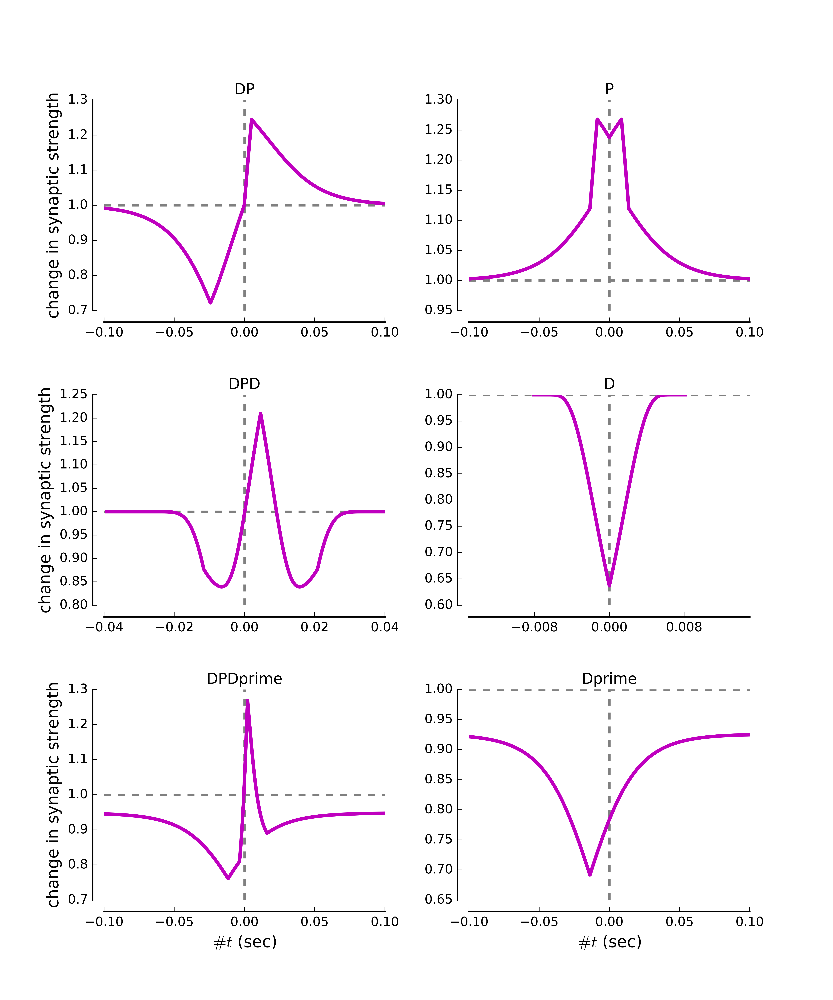
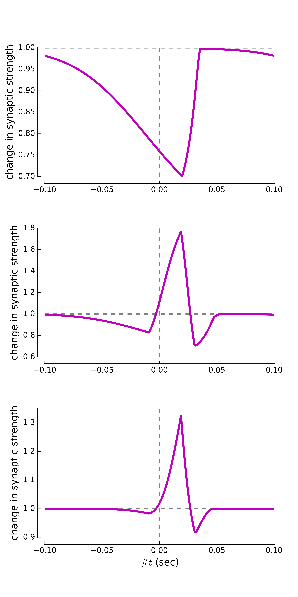
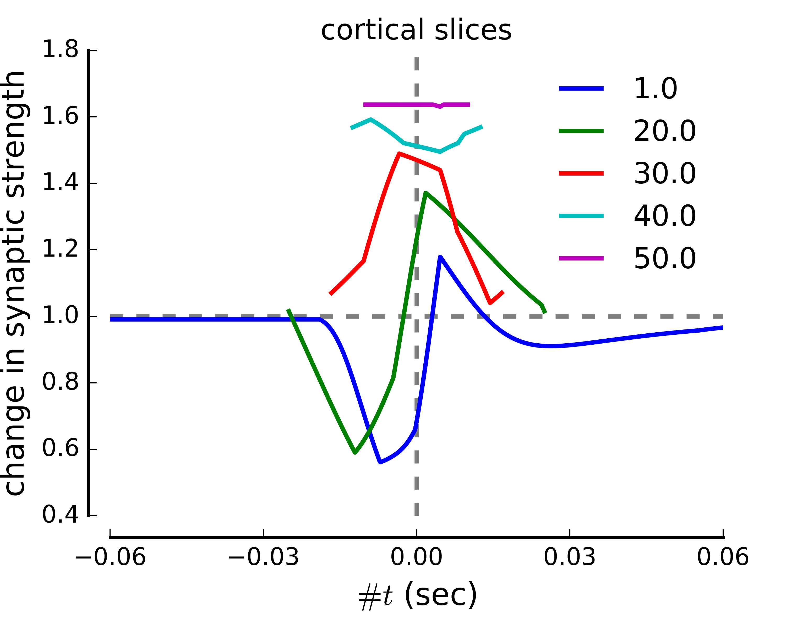

Calcium-bases plasticity model
==============================

In the calcium-based plasticity model, pre- and postsynaptic spike induce calcium transients. Synaptic depression or potentiation is induced whenever the compound calcium trace crosses the depression or the potentiation threshold, respectively. 

The here published python scripts implement the calculations to obtain the change in synaptic strength for pre-post spike-pairs as well as pre-spike and post-pair stimulation.

For more details, please refer to :

**Graupner M and Brunel N (2012).**
Calcium-based plasticity model explains sensitivity of synaptic changes to spike pattern, rate, and dendritic location. 
*PNAS 109 (10): 3991-3996.*

[Link to PNAS](http://www.pnas.org/content/109/10/3991.abstract)

Features
-----------
* The `timeAboveThreshold` class calculates the time the compound calcium trace spends above a given threshold for pre-post spike-pair, as well as pre-spike and post-burst stimulation protocols. The presentation frequency of the pattern is taken into account. 
* The up and down transition probabilities are furthermore calculated and converted into a change in synaptic strength considering the initial distribution of synapses and the ratio of synaptic strength between the UP and the DOWN state. 
* The basic results are plotted. 

### Fig. 2 : Diversity of STDP curves in response to spike pair stimulation.


### Fig. 3 : Numbers of postsynaptic spikes and repetitions of the stimulation motif qualitatively change the STDP curve.


### Fig. 4 : Plasticity vs. firing frequency.



Change parameters and re-produce Figures
-----------

The parameter values for the stimulation protocol can be changed in `Graupner2012PNAS_FigXX.py` (with XX=2,3 or 4B). Equivalently, the parameters of the plasticity model implementation can be changed in  `synapticChange.py` . The png and pdf versions of the figures can be produced by running the scripts
```python
python Graupner2012PNAS_Fig2.py
python Graupner2012PNAS_Fig3.py
python Graupner2012PNAS_Fig4B.py
```

Requires
-----------
Standard python packages such as **numpy**, **scipy**, **pylab**, **time**, **os**,  **sys** and **matplotlib** are required.

License
-----------
This program is free software; you can redistribute it and/or
modify it under the terms of the GNU General Public License
as published by the Free Software Foundation; either version 2
of the License, or (at your option) any later version.

This program is distributed in the hope that it will be useful,
but WITHOUT ANY WARRANTY; without even the implied warranty of
MERCHANTABILITY or FITNESS FOR A PARTICULAR PURPOSE.  See the
GNU General Public License for more details.

You should have received a copy of the GNU General Public License
along with this program.  If not, see <http://www.gnu.org/licenses/>.

